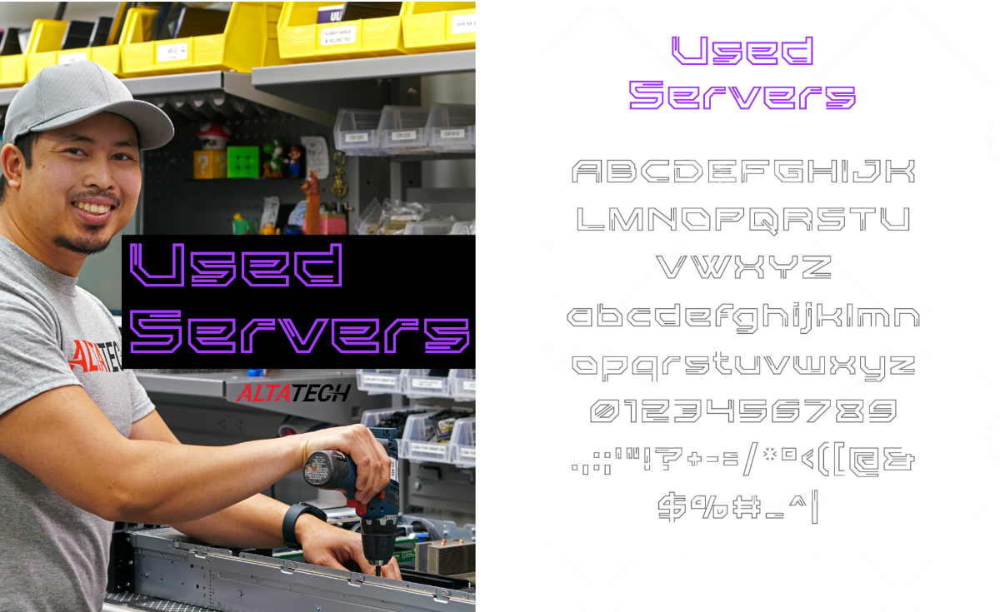

# Used Servers

Used Servers is a retro tech font inspired by the excess server equipment we receive every day. Drawing from the visual styles of the likes of Dell, HP, IBM, Lenovo and Cisco UCS Servers and even old DEC computers or the latest hyperscale ODM systems from SuperMicro, Winstrom and Quanta.
The family includes a standard style with an additional bold weight, suitable for all print uses.
Created by [Alta Technologies](https://altatechnologies.com/), this is a tribute to the new, used and refurbished servers that we’ve been buying and selling to clients globally since 1995. Alta is the leading dealer of excess server equipment in North America.

# Download
[Download](https://github.com/Alta-Technologies/used-servers-font/archive/master.zip) the project and find the OpenType font files in the fonts/otf directory.

# License
The font may be used for full personal or commercial use, we only ask that you provide a reference back to our company website, if you choose to use it.  https://www.altatechnologies.com
